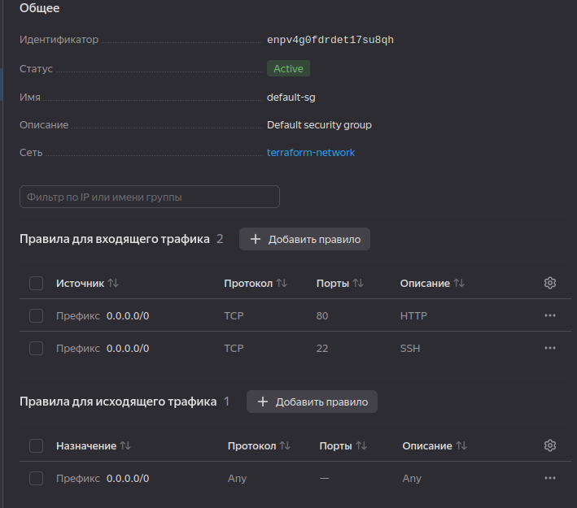
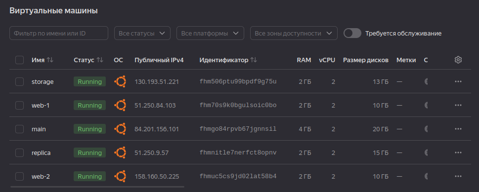
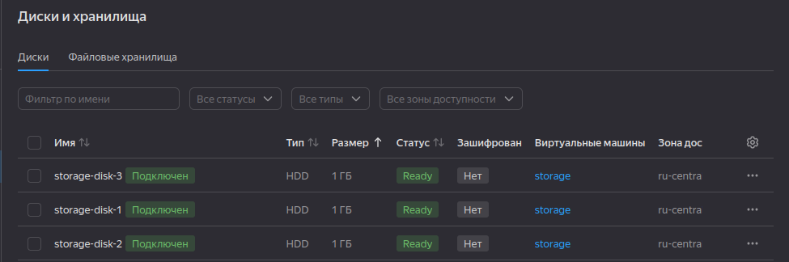
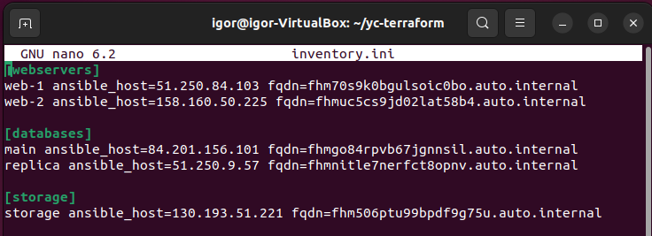

# Домашнее задание к занятию «Управляющие конструкции в коде Terraform»
Выполнил: Береснев Игорь Андреевич

---

Задание 1

Изучите проект.
Инициализируйте проект, выполните код.

Приложите скриншот входящих правил «Группы безопасности» в ЛК Yandex Cloud .

### Скриншот входящих правил группы безопасности

Задание 2

Создайте файл count-vm.tf. Опишите в нём создание двух одинаковых ВМ web-1 и web-2 (не web-0 и web-1) с минимальными параметрами, используя мета-аргумент count loop. Назначьте ВМ созданную в первом задании группу безопасности.(как это сделать узнайте в документации провайдера yandex/compute_instance )
Создайте файл for_each-vm.tf. Опишите в нём создание двух ВМ для баз данных с именами "main" и "replica" разных по cpu/ram/disk_volume , используя мета-аргумент for_each loop. Используйте для обеих ВМ одну общую переменную типа:

variable "each_vm" {
type = list(object({  vm_name=string, cpu=number, ram=number, disk_volume=number }))
}

При желании внесите в переменную все возможные параметры. 3. ВМ, описанные в файле count-vm.tf, должны создаваться после ВМ, описанных в файле for_each-vm.tf. 4. Используйте функцию file в local-переменной для считывания ключа ~/.ssh/id_rsa.pub и его последующего использования в блоке metadata, взятому из ДЗ 2. 5. Инициализируйте проект, выполните код.

### Скриншот виртуальных машин

Задание 3

Создайте 3 одинаковых виртуальных диска размером 1 Гб с помощью ресурса yandex_compute_disk и мета-аргумента count в файле disk_vm.tf .
Создайте в том же файле одиночную(использовать count или for_each запрещено из-за задания №4) ВМ c именем "storage" . Используйте блок dynamic secondary_disk{..} и мета-аргумент for_each для подключения созданных вами дополнительных дисков.

### Скриншот виртуальных дисков

Задание 4

В файле ansible.tf создайте inventory-файл для ansible. Используйте функцию tepmplatefile и файл-шаблон для создания ansible inventory-файла из лекции. Готовый код возьмите из демонстрации к лекции demonstration2. Передайте в него в качестве переменных группы виртуальных машин из задания 2.1, 2.2 и 3.2, т. е. 5 ВМ.
Инвентарь должен содержать 3 группы и быть динамическим, т. е. обработать как группу из 2-х ВМ, так и 999 ВМ.
Добавьте в инвентарь переменную fqdn.

### Скриншот содержимое inventory.ini

